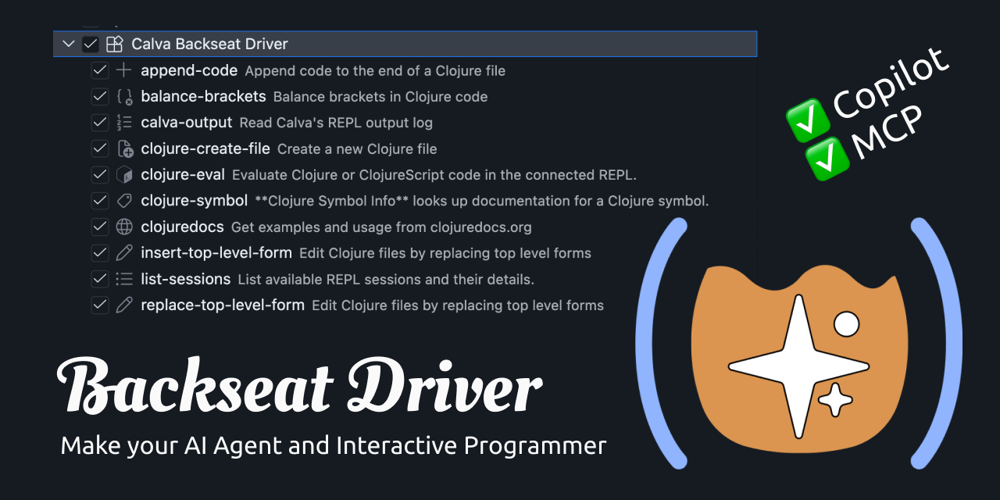

# Calva Backseat Driver

### **Install Extension and done**

(MCP takes some config)

### Leveraging Calva API

- **Sees all connected REPLs**
- **Evaluate Clojure Code**
  - AI makes an excellent Interactive Programmer
- **Structural Editing Tools**
- **Bracket Balancer**

